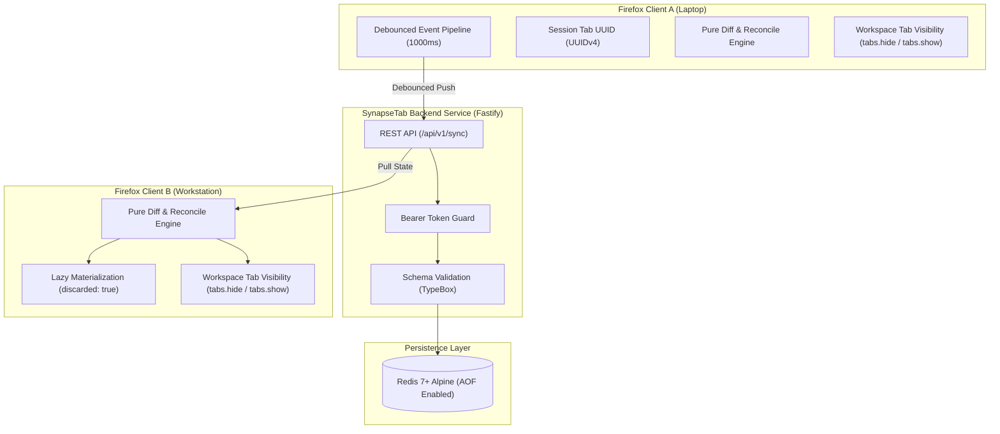

# SynapseTab

**Ultra-lightweight, self-hosted workspace and tab state synchronization for Mozilla Firefox.**

[](https://github.com/marco/SynapseTab/actions/workflows/ci.yml)
[](LICENSE)
[](https://addons.mozilla.org)
[](https://ghcr.io)

---

> Note: This project is currently under development. You’re welcome to try it out, modify it, improve it and report any bugs on the dedicated Issues page, or open a Pull Request – thank you very much for your help!
This project was created to meet my own needs, but as I’m a strong believer in the open-source community, I thought it would be useful and helpful to make it public and available to everyone 😄


## 1. Project GOALS

SynapseTab is an Open-Source tab and workspace synchronization system engineered for multi-workstation setups. It replaces proprietary cloud synchronization with a self-hosted solution that requires:
- **Zero cloud reliance**
- **Zero user accounts or telemetry**
- **Zero perceived latency**

---

## 2. Core Architecture



### 1. Workspaces
Workspaces in SynapseTab **never** partition cookies, LocalStorage, or session tokens. All tabs live in the same window under a unified browsing context:
- Inactive workspace tabs are tucked away using `browser.tabs.hide()`.
- Active workspace tabs are made visible with `browser.tabs.show()`.
- Transitions safely activate destination tabs before hiding origin tabs, adhering to Mozilla's tab-hiding rules.

### 2. Stable Tab Identity
Because Firefox internal `tabId`s are volatile across browser restarts, SynapseTab assigns an immutable UUIDv4 upon tab creation and persists it across sessions using `browser.sessions.setTabValue(tabId, "tab_uuid", uuid)`.

### 3. Aggregation & Debounce
Local tab operations (`tabs.onCreated`, `tabs.onUpdated`, `tabs.onRemoved`, `tabs.onMoved`, `tabs.onActivated`) are aggregated in memory. State sync payloads are dispatched to the backend only after a strict **1000ms debounce** window of user inactivity.

### 4. Lazy Tab Materialization
Incoming remote tabs are materialized in a suspended state using:
```typescript
browser.tabs.create({ url: remoteTab.url, discarded: true, active: false })
```
This guarantees **zero network requests** and **zero RAM consumption** until a tab is explicitly brought to focus by the user.

### 5. Reconciliation algorithm
State reconciliation is computed via a `diff` algorithm that produces a plan of actions to apply to the local state to match the remote state.


### 6. Durable Persistence Layer
State is stored in Redis 7+ with Append-Only file (`appendonly yes`) logging enabled, keyed under `tabvortex:workspaces:<user_id>`.

---

## 3. JSON Data Contract

```json
{
  "client_id": "laptop-linux-01",
  "updated_at": 1773329000,
  "active_workspace_id": "hacking-p1",
  "workspaces": [
    {
      "id": "uni",
      "name": "University",
      "tabs": [
        {
          "uuid": "550e8400-e29b-41d4-a716-446655440000",
          "url": "https://portal.university.edu",
          "title": "Student Portal",
          "favIconUrl": "https://portal.university.edu/favicon.ico",
          "pinned": false,
          "index": 0
        }
      ]
    },
    {
      "id": "hacking-p1",
      "name": "Hacking Project 1",
      "tabs": [
        {
          "uuid": "7c9e6679-7425-40de-944b-e07fc1f90ae7",
          "url": "https://target.local/admin",
          "title": "Admin Dashboard",
          "favIconUrl": "https://target.local/favicon.ico",
          "pinned": false,
          "index": 0
        }
      ]
    }
  ]
}
```

---

## 4. Quickstart & Local Development

See [docs/LOCAL_DEVELOPMENT.md](docs/LOCAL_DEVELOPMENT.md) for full concurrency testing scenarios.

---

## 5. Automated Testing Suite

The codebase enforces strict test-driven development:

```bash
# Run all unit and integration tests
npm test

# Run pure reconciliation tests (diff.test.ts)
npm run test:extension

# Run Fastify & Redis integration tests (server.test.ts)
npm run test:server

# Validate Firefox MV3 compliance
npm run lint:web-ext
```

---

## 6. Production Deployment

### Docker Compose
Deploy SynapseTab on a home server (in my case Proxmox, but works also with Portainer, Rancher or just Docker) behind a WireGuard VPN or reverse proxy:

```bash
# 1. Create production environment configuration
cp .env.example .env
# Edit .env to set your SYNC_SECRET

# 2. Start the production stack
docker compose -f deploy/docker-compose.prod.yml up -d
```

### Backend Endpoints
- `POST /api/v1/sync`: Persists workspace snapshot (Requires `Authorization: Bearer <SYNC_SECRET>`).
- `GET /api/v1/sync`: Returns latest workspace snapshot (Requires `Authorization: Bearer <SYNC_SECRET>`).
- `GET /api/v1/health`: Readiness probe returning 200 OK and Redis connection status.

---

## 7. License

Released under the **MIT License**. 100% Free and Open-Source Software (FOSS).

## 8. AI usage

The entire project was developed using the Antigravity agent-based IDE, in accordance with all best practices for software development and the use of AI.
