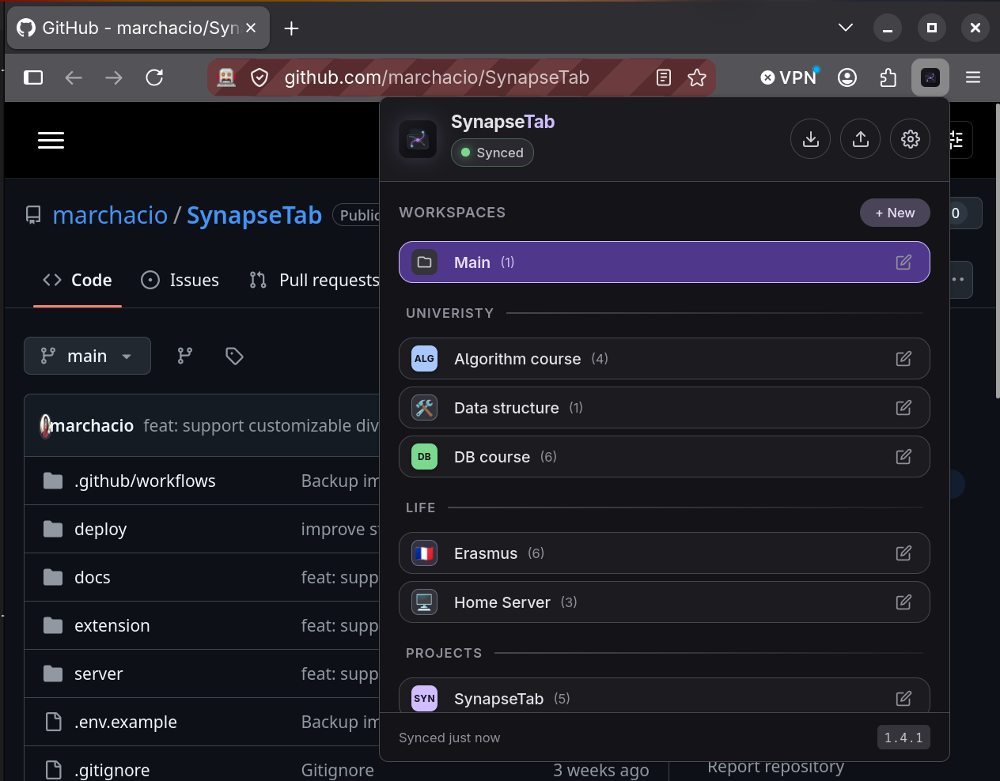
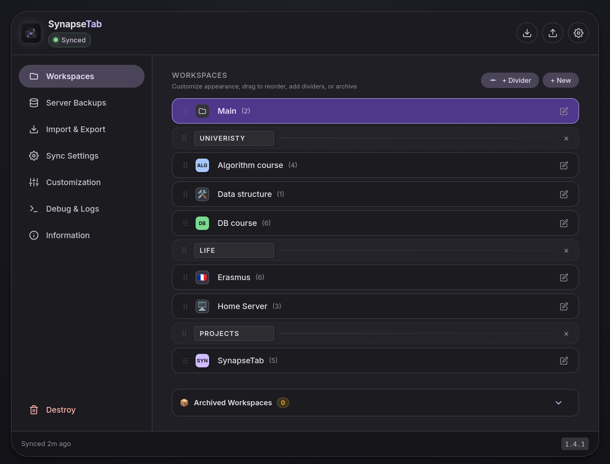

<p align="center">
  
</p>

<h1 align="center">SynapseTab</h1>

<p align="center">
  <strong>Ultra-lightweight, self-hosted workspace and tab state synchronization for Mozilla Firefox.</strong>
</p>

<p align="center">
  <a href="https://github.com/marchacio/SynapseTab/actions/workflows/ci.yml"></a>
  <a href="LICENSE"></a>
  <a href="https://addons.mozilla.org"></a>
  <a href="https://ghcr.io"></a>
</p>


> Note: This project is currently under development. You’re welcome to try it out, but keep in mind it is a work in progress. Bug fixes and suggestions are always welcome, feel free to open an Issue or a Pull Request – thank you very much!

SynapseTab is an Open-Source self-hosted workspaces and tabs synchronization system engineered for multi-workstation setups. It is a zero-configuration system that works automatically in the background and requires no user interaction.

<p align="center">
   
  
</p>

## Installation & Quickstart

SynapseTab consists of two components:
1. **Backend Server:** A lightweight Fastify + Redis service storing your workspace snapshots and automatic backups.
2. **Firefox Extension:** The client running locally in your browser to organize workspaces and synchronize tabs.

### Step 1: Deploy the Backend

Deploy the server stack using Docker Compose:

```bash
# Clone the repo
git clone https://github.com/marchacio/SynapseTab.git
cd SynapseTab

# Copy and customize .env file with your SYNC_SECRET and backup policy (if needed)
cp .env.example .env
nano .env

# Start server
docker compose --env-file .env -f deploy/docker-compose.prod.yml up -d --build server
```

> **Security Tip:** Put the backend behind an HTTPS reverse proxy (such as Caddy, Nginx, or Cloudflare Tunnel) to ensure all traffic and authentication tokens are encrypted in transit.

### Step 2: Install the Firefox Extension

- **From Firefox Add-ons (AMO):** *(Publishing to Mozilla Add-ons in progress)*
- **From Source Package:**
  1. Build the distributable extension package:
     ```bash
     npm install
     npm run package:extension
     ```
  2. The packaged extension is generated in `web-ext-artifacts/synapsetab-*.zip`.
  3. In Firefox, navigate to `about:debugging#/runtime/this-firefox`, click **Load Temporary Add-on...**, and select `extension/dist/manifest.json` or the generated zip.

### Step 3: Connect & Sync

1. Click the **SynapseTab** icon in your Firefox toolbar.
2. Click the gear icon to open **Settings & Manager**.
3. Under **Server Connection**, configure:
   - **Backend URL:** `https://your-domain.com` or `http://localhost:8080` for local setups.
   - **Sync Secret Token:** The secret you defined in `SYNC_SECRET`.
4. Click **Test Connection** to verify connectivity, then click **Save Configuration**.

Your current tabs and workspaces will immediately synchronize. 

## Local Development

See [docs/LOCAL_DEVELOPMENT.md](docs/LOCAL_DEVELOPMENT.md) for detailed information about local development and testing.

## License

Released under the **MIT License**. 100% Free and Open-Source Software.

## AI usage

The entire project was developed using the Antigravity agent-based IDE (as you can see from the GEMINI.md file), in accordance with all best practices for software development and the use of AI.
